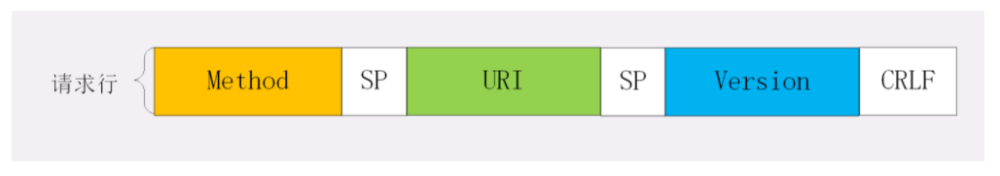
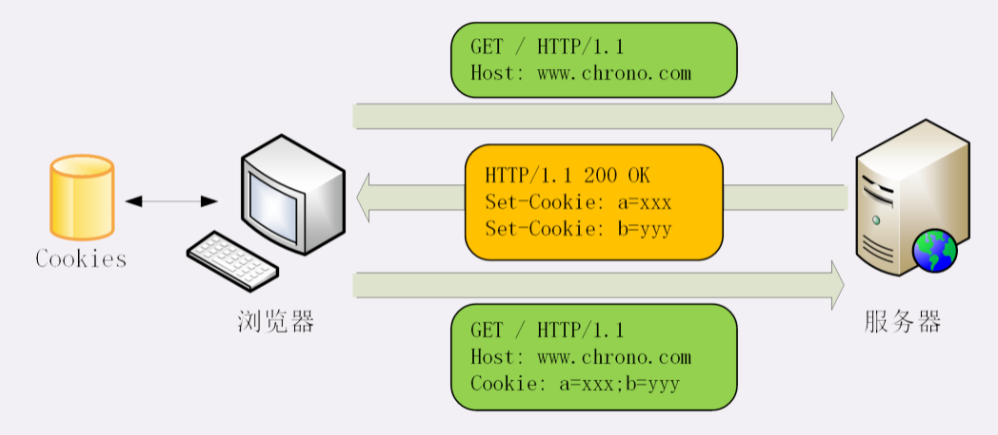
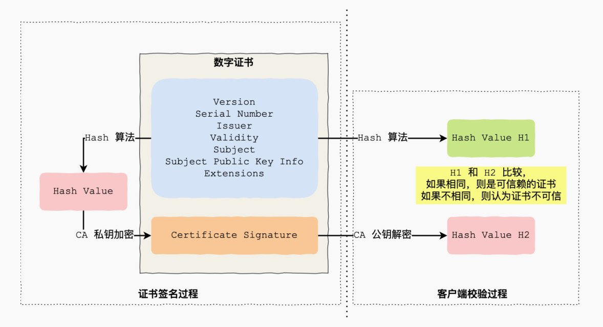
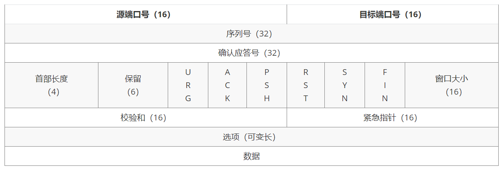
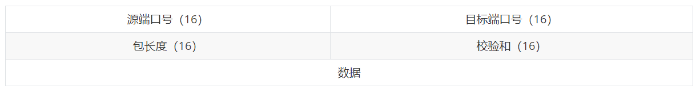
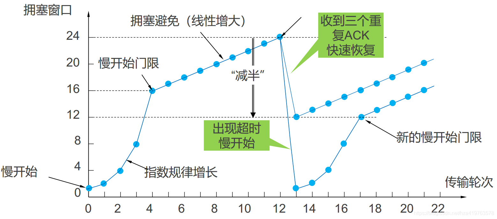
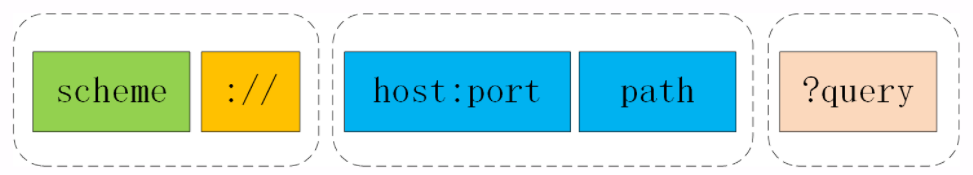
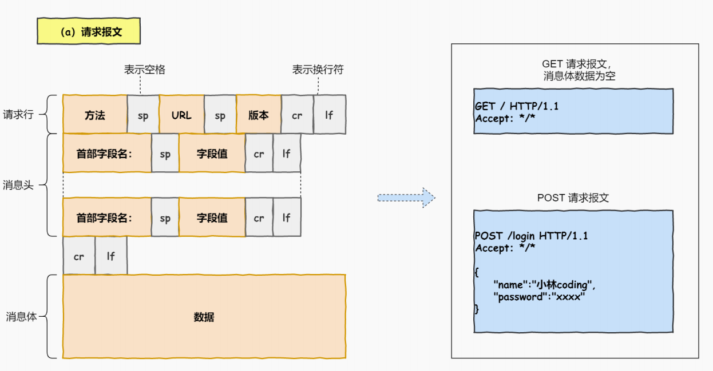
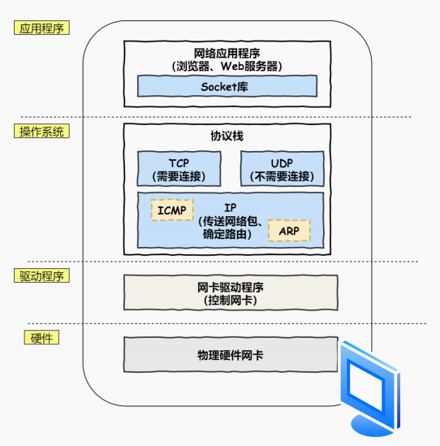

## 网络模型

### 五层模型

应用层：

​	只需要专注于为用户提供应用功能，不用去关心数据是如何传输的

​	应用层工作在操作系统中的用户态，传输层及以下则⼯作在内核态

传输层：

​	为应用层提供网络支持

​	传输层的报文中会携带端口号，接收方可以识别出该报文是发送给哪个应用

​	传输层服务应用层，实现应用到应用的通信，实际的传输功能交给下⼀层

网络层：

​	实现主机与主机之间的通信

​	实现「没有直连」的两个网络之间通信

数据链路层：

​	为⽹络层提供链路级别传输的服务

​	实现「直连」的两个设备之间通信

物理层：

​	为数据链路层提供⼆进制传输的服务

​	把数据包转换成电信号，让其可以在物理介质中传输

### OSI七层模型

物理层、数据链路层、网络层、传输层、会话层、表示层、应用层

### TCP/IP 分层模型

网络接口层、网络层、传输层、应用层

## 应用层

### HTTP基本概念

#### HTTP是什么？

HTTP是 *超文本 传输 协议* 。

HTTP 是⼀个在计算机世界⾥专门在**两点之间传输**⽂字、图⽚、⾳频、视频等**超文本数据**的**约定和规范**。

#### HTTP常见状态码有哪些？

1xx 类状态码是**提示信息**，是中间状态

2xx 类状态码表示服务器**成功**处理了客户端的请求

​	200 ：一切正常

​	204 ：响应头没有 body 数据

​	206 ：响应返回的 body 数据并不是资源的全部

3xx 类状态码表示客户端请求的资源发生了变动，需要用新的URL重新发送请求，也就是**重定向**

​	**301**：永久重定向

​	**302**：临时重定向

​	**304**：服务器端资源未改变，可直接使用客户端未过期的缓存

​	301 和 302 都会在响应头里使用字段**Location**指明后续要跳转的 URI

4xx 类状态码表示客户端发送的**报文有误**

​	400：笼统错误码

​	403：服务器禁止访问资源

​	**404**：请求的资源在服务器不存在

5xx 类状态码客户端报文正确，但**服务器发生错误**

​	500：笼统错误码

​	501：客户端请求的功能还不支持

​	502：服务器工作正常，访问后端服务器发生了错误

​	503：服务器很忙，暂时无法响应客户端

#### HTTP常见字段有哪些？

*Host* 字段，客户端发送请求时，用来指定服务器的域名，host：www.A.com

*Connection* 字段，客户端要求服务器使用TCP持久连接，方便复用，Connection：Keep-Alive

*Content-Lenght* 字段，表明本次回应的数据长度，Content-Length: 1000（字节）

*Content-Type* 字段，表明本次数据的格式，Content-Type: text/html; charset=utf-8

*Content-Encoding* 字段，表明数据的压缩格式，Content-Encoding: gzip

*Accpet-Encoding* 字段，表明自己可以接受的压缩格式，Accept-Encoding: gzip, deflate

其他字段：

*Set-Cookie* 字段，响应头字段，设置用户标识

*Cookie* 字段，请求头字段，内容是服务器设置的用户标识

*Cache-Control* 字段，缓存控制字段，如：

​	服务器端缓存控制：

​		Cache-Control：max-age=30 ，告诉浏览器这个页面只能缓存30秒，之后过期

​		Cache-Control：no_store，不允许缓存

​	客户端缓存控制：

​		点击刷新，实际上是浏览器在请求头中加“**Cache-Control: max-age=0**”

### Get 和 Post

#### HTTP请求行

请求报文里的起始行也就是**请求行**，它简要地描述了**客户端想要如何操作服务器端的资源**

请求行由三部分构成：

1. 请求方法：是一个动词，如 GET/POST，表示对资源的操作；
2. 请求目标：通常是一个 URI，标记了请求方法要操作的资源；
3. 版本号：表示报文使用的 HTTP 协议版本。

这三个部分通常使用空格（space）来分隔，最后要用 CRLF 换行表示结束

#### GET 和 POST 区别？

GET ，请求从服务器获取资源

POST , 向URL指定的资源提交数据，数据放在报文的 body 里

#### GET 和 POST 方法都是安全和幂等的吗？

在 HTTP 协议⾥，**安全**是指请求⽅法不会**破坏**服务器上的资源

**幂等**，是多次执⾏相同的操作，结果都**相同**

GET 方法安全且幂等， POST 方法不安全不幂等

#### 其他请求方法

**HEAD** 方法可以看做是 GET 方法的一个“简化版”或者“轻量版”。因为它的响应头与 GET 完全相同，所以可以用在很多并不真正需要资源的场合，避免传输 body 数据的浪费。

**PUT** 的作用与 POST 类似，也可以向服务器提交数据，但与 POST 存在微妙的不同，通常 POST 表示的是“新建”，“create”的含义，而 PUT 则是“修改”，“update”的含义

### HTTP特性

#### HTTP优缺点

优点：简单、灵活和易于扩展、应用广泛和跨平台

1. 简单

   HTTP报文格式是header+body，头部信息是简单文本形式

2. 灵活和易于扩展

   HTTP协议的各类请求⽅法、URI/URL、状态码、头字段等都允许开发⼈员⾃定义和扩充，下层可以随意变化

3. 应用广泛和跨平台

   HTTP应用天然跨平台

缺点：无状态、明文传输、**不安全**

1. 无状态

   好处：减轻服务器负担

   坏处：关联性操作非常麻烦

2. 明文传输

   好处：调试便利

   坏处：信息裸奔

3. 不安全

   窃听风险、伪装风险、篡改风险
   
   

#### HTTP/1.1 性能

HTTP/1.1采用 **请求-应答** 通信模式，性能一般：

1. 长连接

   减少TCP连接的重复建立和断开

2. 管道网络传输

   客户端可以发起多个请求，减少整体响应时间

3. 队头阻塞

   ⼀个请求因为某种原因被阻塞时，在后⾯排队的所有请求也⼀同被阻塞

### HTTP 连接管理

#### 长连接和短连接

早期HTTP/0.9，客户端每次发送请求，都需要建立TCP连接，收到响应报文后立即关闭连接，被称为“短连接”

HTTP/1.1默认启用长连接，只要向服务器发送了第一次请求，后续的请求都会重复利用第一次打开的 TCP 连接

可以在请求头使用字段 Connection， 值是 keep-alive，明确要求使用长连接；

不管客户端是否显示要求长连接，若服务器支持长连接，总会在响应报文中放**Connection: keep-alive**字段

#### 长连接的缺点

长连接会占用服务器资源，如果有大量长连接只收不发，很快就会耗尽服务器的资源

解决方法：

1. 客户端可以在最后发送的HTTP报文上加上**Connection: close**字段，主动关闭连接
2. 服务器端采用一些策略，对长连接进行管理
   1. 使用**keepalive_timeout**指令，设置长连接的超时时间，如果在一段时间内连接上没有任何数据收发就主动断开连接
   2. 使用**keepalive_requests**指令，设置长连接上可发送的最大请求次数

#### 队头阻塞

队头阻塞与短连接和长连接无关，是由 请求-应答 模型所导致的

如果队首的请求因为处理的太慢耽误了时间，那么队列里后面的所有请求也不得不跟着一起等待，结果就是其他的请求承担了不应有的时间成本

性能优化：

1. 并发连接

   对同一个域名同时发起多个长连接

2. 域名分片

   服务端多开几个域名，可以增多长连接的数量

#### HTTP Cookie 机制

HTTP 是无状态的，在进行一些关联操作，如购物网的各种操作，需要频繁验证身份，Cookie 使得用无状态HTTP协议记录稳定的状态信息成为了可能；

**Cookie 的工作过程：**

主要用到两个字段：响应头字段：Set-Cookie 和请求头字段 Cookie

在客户端第一次访问服务器时，服务器为该客户端创建一个唯一标识， 格式是 key = value，放入Set-Cookie 字段中，随着响应报文发给客户端；客户端第二个请求里面添加Cookie字段以及Set-Cookie 字段中内容，服务器验证Cookie就可以识别用户;

服务器可以添加多个Set-Cookie，浏览器发送时不需要用多个 Cookie 字段，只要在一行里用  ;  隔开就行

此外还可以设置Cookie 的生存周期和作用域

使用 Expire 属性指定绝对过期时间，

使用 Max-Age 属性指定相对过期时间，

使用 Domain 和 Path 属性指定了 Cookie 所属的域名和路径，让浏览器仅发送给特定的服务器和 URI，避免被其他网站盗用；

使用 HTTPOnly 告诉浏览器，此cookie只能使用HTTP协议传输，禁止其他形式的访问，浏览器的JS获取cookie的API就会失效

### HTTPS

#### HTTPS 与 HTTP 区别？

1. HTTPS 在 TCP 和 HTTP 加入了 TLS / SSL 安全协议，报文加密传输
2. HTTPS 在 TCP 三次握手之后，还要进行 TLS / SSL 握手
3. HTTP 端口号是 80，HTTPS 端口号是 443
4. HTTPS 需要向CA（证书权威机构）申请数字证书

#### HTTPS 解决了 HTTP 的哪些问题？

1. 信息加密 解决窃听问题
2. 校验机制 解决篡改问题
3. 数字证书 解决伪装问题

#### HTTPS 是如何解决 HTTP 不安全问题的？

1. 混合加密（对称加密和非对称加密）实现信息的机密性
2. 摘要算法  实现信息的完整性
3. 服务器公钥放入数字证书，防止冒充

#### 密码套件

密码套件命名规范：密钥交换算法 + 签名算法 + 对称加密算法 + 摘要算法

如 ECDHE-RSA-AES256-GCM-SHA384 表示：握手时使用ECDHE算法进行密钥交换，用RSA签名和身份认证，握手后的通信使用AES对称加密算法，密钥长度为256位，摘要算法SHA384用来消息认证和产生随机数

**常见加密算法：**

对称加密算法：加密和解密使用的密钥相同，常用的有  AES、ChaCha20

非对称加密算法：有公钥和私钥，公钥加密私钥解密，私钥加密公钥解密，常用的有   RSA（素数相关）、ECDHE (椭圆相关)

密钥交换算法：使用非对称加密算法，私钥加密公钥解密，常用的有   RSA（素数相关）、ECDHE (椭圆相关)

签名算法：使用非对称加密算法加摘要算法，私钥加密公钥解密，常用的有 RSA

摘要算法：哈希算法，将任意数据压缩固定长度的摘要字符（生成指纹），是不可逆的过程（无法从摘要推出原文），有雪崩效应（对原文微小的改动会导致输出剧烈变化，因而可以保证数据完整性），常用的有    MD5（安全强度较低）、SHA-2（安全程度较高）

#### 数字证书

一个数字证书，通常包含**公钥；持有者信息；权威机构（CA）信息；CA的数字签名以及使用的算法；证书有效期**

**数字证书签发和验证流程：**

CA签发数字证书的过程，如上图左边：

1. CA将证书信息打包，对包进行哈希计算，得到哈希值
2. CA将哈希值用私钥加密，生成数字签名
3. 将数字签名添加到证书上，形成数字证书

客户端校验服务端数字证书的过程，如上图右边：

1. 用相同的哈希算法，计算证书的哈希值 H1
2. 通过浏览器和操作系统集成的CA公钥信息，用CA公钥解密数字签名，得到哈希值 H2
3. 比较 H1 和 H2 ，若值相同，则为可信赖的证书，否则证书不可信赖

PS ： 证书通常不是根证书机构签发的，是由中间证书机构签发的，这里面涉及到证书的信任链

#### HTTPS 是如何建立连接的，期间交互了什么？

涉及四次通信：

**TLS第一次握手：**

客户端向服务器发起加密通信请求，发送

Client Hello

* 客户端支持的 TLS 版本号
* 客户端支持的密码套件列表
* 客户端生产的随机数 Client Random

**TLS第二次握手：**

服务器收到客户端的请求后，保留客户端的随机数，响应客户端，发送以下信息

1. Server Hello

   * 确认TLS 版本号，若不支持就关闭连接
   * 客户端支持的密码套件列表中一个合适密码套件
   * 服务器生产的随机数 Server Random

2. Server Certificate

   数字证书，内含服务器公钥

3. Server Hello Done

   表明本次打招呼完毕

**客户端验证数字证书：**

用证书上的哈希算法，将证书进行哈希计算，得到一个哈希值 H1;

将数字签名用浏览器和操作系统收集的CA公钥解密，得到另一个哈希值 H2；

比较 H1 和 H2 ,若相同，则数字证书可信

**TLS第三次握手：**

客户端生成一个新的随机数pre-master（也就是整个流程的第三个随机数），用服务器RSA公钥加密该随机数，发送给服务器

客户端利用 Client Random、Server Random、pre-master ，这三个随机数，生成会话密钥，即对称密钥

生成会话密钥后，客户端会发送一个报文告诉服务器接下来会使用会话密钥进行通信

然后把之前所有发送过的消息做个摘要，通过会话密钥加密，发送给服务器验证

**TLS第四次握手：**

服务器收到第三次握手的消息后，用RSA私钥解密，得到pre-master

至此，双方共享了三个随机数：Client Random、Server Random、pre-master ，根据这三个随机数生成会话密钥

生成会话密钥后，向客户端发送一个报文，表示接下来使用会话密钥进行通信

然后把之前所有发送过的消息做个摘要，通过会话密钥加密，发给客户端验证

双方验证加密和解密没问题，那么握手完成，随后双方使用会话密钥进行通信

#### 为什么要三个随机数？

这是出于TLS 设计者的考虑，他们不信任客户端或服务器随机数的可靠性，为了保证真正的“完全随机”，“不可预测”，把三个不可靠的随机数混合起来，那么“随机”的程度就非常高了，足够让黑客难以破解

#### ECDHE 相比 RSA好在哪里？

先说不同：

1. 使用 ECDHE 实现密钥交换，服务器第二次握手时会额外发出 “Server Key Exchange” 消息，里面是椭圆曲线的公钥，并用私钥签名
2. 客户端在第三次握手前，也生成一个椭圆曲线的公钥，在第三次握手中用 “Client Key Exchange” 消息发给服务器
3. 客户端和服务器此时共享了两个随机数，两对椭圆曲线公钥，把这些作为参数，用ECDHE算法可以**各自在本地生成第三个随机数**

ECDHE 相比 RSA 好在提高了安全性和性能：

1. 使用ECDHE，客户端在第三次握手后，不必再等待服务器返回 finish ，立即可以用会话密钥传输应用数据了，相当于抢跑，相比RSA，**省去一个消息的往返时延**

2. ECDHE **更安全**，解决 RSA 不支持前向保密的问题：

   用RSA的话，一旦私钥泄漏，报文就会被破解；用ECDHE ,每一次对称密钥都是实时生成的，并且第三个随机数是各自在本地生成而不是网络上传输的

#### HTTPS 如何优化？

硬件优化：

​	HTTPS 协议是计算密集型，而不是I/O密集型，相比于把钱花在网卡、硬盘等地，更应该花在CPU上，可选择支持AES-NI特性的CPU

软件优化：

​	升级系统内核，升级协议版本

协议优化：

​	把RSA换成ECDHE，把TLS 1.2 升级为 1.3，相比1.2 减少一个时延

证书优化：

​	证书传输和验证方面的优化

会话复用：

 	1. **Session ID **的工作原理是，客户端和服务器首次TLS握手后，双方在内存缓存会话密钥，并用唯一的Session ID来标记，Session ID 和会话密钥的关系相当于 key - value的关系，当客户端再次连接时，hello消息里会带上Session ID，服务器收到后就会从内存找，如果找到就直接用该会话密钥通信，但它有两个缺点：
     * 服务器要保存每个客户端的会话密钥，随着客户端的增多，**服务器的内存压力会变大**
     * 网站服务一般是由多台服务器通过负载均衡提供服务的，客户端再次连接时，**不一定命中上次访问的服务器**，需要再走一次TLS握手流程
 	2. **Session Ticket** 是为了解决Session ID的问题诞生的，服务器不再缓存每个客户端的会话密钥，而是把缓存的工作交给了客户端，类似Cookie，首次建立连接后，服务器会将 会话密钥 加密作为 Ticket 发给客户端，客户端缓存该Ticket；客户端再次连接服务器时，会发送Ticket，服务器解密后得到上次的会话密钥，验证有效期，用会话密钥恢复会话；只要每台服务器的加密 会话密钥的密钥一样，就能适应负载均衡

### HTTP/1.1、HTTP/2、HTTP/3演变

#### HTTP/1.1 相比 1.0 提高了什么性能

1.  使用长连接，减少1.0短连接的性能开销
2.  管道网络传输，减少整体响应时间

虽有提高，但性能一般（队头阻塞）

#### 针对HTTP/1.1 的性能瓶颈，HTTP/2 做了什么优化？

由于 HTTPS 已经在安全方面做的非常好了，所以 建立在HTTPS基础上的 HTTP/2 的唯一目标就是改进性能

首先，HTTP/2 兼容 HTTP/1，并建立在HTTPS基础上，更加安全

1. 头部压缩

   HTTP/1 里面有 Content-Encoding 字段指定Body的压缩方式，但却忽略了header，header通常有许多固定字段，在多个请求报文中通常是重复的，这就非常浪费带宽了，HTTP/2 针对这个开发了专门的 HPACK 算法，在客户端和服务器建立字典，可达到很高的压缩率：

   为一些最常用的字段定义一个只读的静态表；还有动态表在静态表后面，在编码解码的时候随时更新

2. 二进制帧

   HTTP/2 弃用了 HTTP/1 里的ASCII纯文本格式，全面采用二进制格式，将header + body 变成一个个二进制帧，方便计算解析

3. 并发传输

   * 数据流，不同stream的帧不需要按序发送（并发不同的流），同一stream里的帧是有序的，还可以指定流的优先级

   * 多路复用，一个连接并发多个请求，不用按序回应

4. 服务器推送，可以主动向客户端发信息

#### HTTP/2 有哪些缺陷？HTTP/3 做了哪些优化？

缺陷 ：一旦**丢包**，会触发TCP重传机制，一个TCP连接中所有HTTP请求都要等待丢的包重传回来

这是基于TCP传输层的问题，所以**HTTP/3把下层协议换成了UDP**

虽然UDP不可靠，但是基于UDP的**QUIC协议**可以实现类似TCP的可靠传输

因为QUIC是新协议，HTTP/3 现在普及缓慢

## 传输层

### TCP 和 UDP 基本认识

#### TCP头部格式

序列号：随机数，解决包乱序问题

确认应答号：指下一次期望收到的数据的序列号，解决不丢包问题

控制位：

* ACK：该位为1时，「确认应答号」字段有效
* RST：该位为1时，表示TCP连接出现异常必须强制断开连接
* SYN：该位为 1 时，表示希望建⽴连接，并在其「序列号」字段设定初始值
* FIN：该位为 1 时，表示今后不会再有数据发送，希望断开连接

#### 什么是TCP？

TCP是**面向连接的、可靠的、基于字节流**的传输层通信协议

* 面向连接：只能是一对一连接
* 可靠的：TCP保证一个报文一定到达接收端
* 字节流：消息是没有边界并且有序的

#### 什么是TCP连接？如何唯一确定一个TCP连接？

RFC 793定义的连接：

用于保证可靠性和流量控制维护的某些状态信息，这些信息的组合，包括**Socket、序列号和窗口大小称为连接。**

建立一个TCP连接需要客户端与服务器达成上述三个信息的共识

* Socket：由IP地址和端口号组成
* 序列号：解决乱序问题
* 窗口大小：流量控制

**TCP四元组**可以唯一确定一个连接：{ 源地址、源端口、目标地址、目标端口 }

#### 为什么需要TCP协议？TCP工作在哪一层？

**IP层是不可靠的**，它不保证网络包的交付、按序交付和数据完整性，需要由传输层协议负责

TCP是一个工作在传输层的**可靠**数据传输的协议，能确保接受端的网络包**无损坏、无间隔、非冗余和按序的**

#### 有一个IP的服务器监听一个端口，怎么计算它的TCP最大连接数？

服务器通常固定在某个本地端口上监听，等待客户端的连接请求，因此**客户端的IP和端口是可变的**

理论的TCP最大连接数 = 客户端IP数 * 客户端端口数

然而服务器最大并发TCP连接数远无法达到上限，受文件描述符和内存的限制

#### UDP头部格式

⽬标和源端⼝：主要是告诉 UDP 协议应该把报⽂发给哪个进程。

包⻓度：该字段保存了 UDP ⾸部的⻓度跟数据的⻓度之和。

校验和：校验和是为了提供可靠的 UDP ⾸部和数据⽽设计。

#### UDP 和 TCP有什么区别呢？应用场景分别是什么？

区别：

1. 连接
   * TCP传输数据前需要建立连接
   * UDP不需要连接，即刻传输数据
2. 服务对象
   * TCP一对一服务
   * UDP支持一对一、一对多、多对多的交互通信
3. 可靠性
   * TCP是可靠交付数据的，无差错、不丢失、不重复、按序到达
   * UDP是尽最大努力交付，不保证可靠交付
4. 拥塞控制、流量控制
   * TCP有拥塞控制、流量控制
   * UDP没有，即使网络拥堵，也不影响UDP发送速率
5. 首部开销
   * TCP首部没用到选项时是20个字节
   * UDP首部只有8个字节，固定不变
6. 传输方式
   * TCP是流式传输，没有边界，保证顺序和可靠
   * UDP是一个包一个包的发送，有边界，可能丢包和乱序
7. 分片不同
   * TCP的数据大小若大于MSS，在传输层分片，若丢失一个分片，只需重传该分片即可
   * UDP的数据大小若大于MTU，在IP层分片，若丢失一个分片，在实现可靠传输的UDP时需要重传所有数据包

应用场景：

TCP常用于FTP文件传输、HTTP / HTTPS

UDP常用于包总量较少的通信，如DNS、SNMP、视频音频等多媒体通信、广播通信

#### 为什么UDP头部没有首部字段，而TCP头部有？

因为TCP首部有可变长的选项字段，UDP头部长度固定

#### 为什么UDP头部有包长度字段，而TCP头部没有？

TCP数据长度 = IP总长 - IP首部长 - TCP首部长； 因此不需要包长度字段

UDP也是基于IP层，也可以用上述公式计算数据长度，目前来看UDP的包长度字段有点冗余（为了网络处理方便，首部长度需要是4字节的倍数）

### TCP 连接建立和断开连接

#### 三次握手过程

起初客户端和服务器处于close状态，先是服务器主动监听某个端口，处于listen状态

第一次握手，客户端向服务器发送一个SYN报文，初始化序列号client_ISN，然后进入SYN_SEND状态

第二次握手，服务器收到客户端的SYN报文后,  向客户端发送一个SYN+ACK报文，也初始化序列号server_ISN，将client_ISN+1作为确认应答号，然后进入SYN_RCVD状态

第三次握手，客户端收到服务器的SYN+ACK报文后，向服务器发送ACK报文，将server_ISN+1作为确认应答号，然后进入Establish状态，服务器收到客户端的ACK报文后，也进入Establish状态，连接建立

#### 为什么需要三次握手？两次，四次不行？

1. 最主要的原因是**防止历史重复连接初始化连接** 

   第一次握手时，假设客户端的SYN报文因为网络拥塞迟迟没有到达服务器，客户端会重传一个新的SYN报文，若新的SYN报文还没到达服务器，旧的SYN报文就到达了，此时服务器会将旧的SYN报文的ISN+1作为确认应答号，发送一个应答报文给客户端，假如只有两次握手，那么此时建立的连接是历史连接；三次握手的话，客户端可以将服务器的应答报文的确认应答号进行上下文比较，就可以避免建立历史连接

2. 同步双方初始序列号

   同步序列号是实现可靠连接的基础。当客户端发送SYN 报⽂的时，需要服务端回⼀个 ACK 报⽂，表示客户端的 SYN 报⽂已被服务端成功接收，那当服务端发送给客户端的时候，依然也要得到客户端的应答回应，**这样⼀来⼀回，才能确保双方的初始序列号能被可靠的同步。**

3. 避免资源浪费

   如果是两次握手，如果客户端的SYN报文阻塞了，重复发送多次SYN报文，就会建立多次无效的冗余连接，造成不必要的资源浪费
   
   

#### 四次挥手过程

双方都可以主动断开连接，现在说客户端主动断开连接的过程

起初客户端和服务器处于连接状态

第一次挥手，客户端向服务器发送一个FIN报文，然后进入FIN_WAIT_1状态

第二次挥手，服务器收到客户端的FIN报文后，回应一个ACK报文，然后、进入CLOSE_WAIT状态，客户端收到服务器的ACK报文后，进入FIN_WAIT_2状态

第三次挥手，服务器处理完数据后，向客户端发送FIN报文，然后进入LAST_ACK状态

第四次挥手，客户端收到服务器的FIN报文后，向服务器发送一个ACK报文，然后进入TIME_WAIT状态，服务器收到客户端的ACK报文后，进入close状态，服务器关闭连接，客户端在等待2MSL时间后，自动进入close状态，客户端关闭连接

#### 为什么需要四次挥手？三次不行？

回顾四次挥手的过程，客户端发送FIN报文后，仅表示客户端不再发送数据了但还能接收数据，服务器收到客户端的FIN报文后，先回复一个ACK报文，因为服务器还有数据需要处理和发送，等处理完后，才向客户端发送FIN报文。因为**服务器的ACK和FIN报文一般会分开发送，所以比三次握手多了一次**。如果服务器收到客户端的FIN报文后，没有数据需要处理和发送了，可以将FIN和ACK合并为一个报文，这种情况缩减为三次也可以。

#### 既然IP层会分片，为什么TCP层还需要MSS呢？

MTU ：一个IP层网络包的最大长度，一般为1500字节

MSS：除去IP和TCP头部，一个网络包所能容纳的TCP数据的最大长度

如果没有MSS，那么TCP的数据会**完全交给IP层分片**，假如TCP数据长度大于MTU，那么就需要在IP层分片，这样的话，当一个分片丢失时，需要重传所有分片，因为所有分片合起来才是一个TCP包；有了MSS，当数据大于MSS时，就**在TCP层分片**，这样每个分片都有TCP头部，当丢失一个分片，只需要重传这个分片即可，这个分片形成的IP包长度自然不会大于MTU，自然不用IP分片了

#### 为什么TIME_WAIT等待的时间是2MSL？

MSL 是报文最大生存时间，2MSL，可以理解为报文一来一回需要的时间

1. **保证连接正确关闭**

   若服务端没有收到四次挥⼿的最后⼀个 ACK 报⽂时，则会重发 FIN 报⽂并等待新的 ACK 报⽂

   等待时间过短的话，客户端可能没收到服务器重发的FIN报文就进入了close状态，等待2MSL，能确保最后的ACK能让对方接收，从而帮助其正常关闭

2. 防止旧连接的数据包

   经过2MSL的时间，足够让两个方向上的数据包都被丢弃，使得旧连接的数据包在网络中自然消失

#### TIME_WAIT过多有什么危害？

一是占用**内存资源**，二是占用**端口资源**

客户端受端口资源限制，如果TIME_WAIT过多，占满了端口资源，会无法创建新连接

服务端受系统资源限制，如果TIME_WAIT过多，系统资源被占满，会无法处理新的连接

#### 如果已经建立了连接，但是客户端突然故障了怎么办？

TCP有**保活机制**，定义一个时间段，在这个时间段内，如果没有任何有关连接的活动，会触发保活机制，每隔一段时间发送一个探测报文，如果连续几个探测报文都没有得到回应，则认为当前TCP连接已经死亡，系统内核将错误信息提交给应用层

### TCP 重传机制、滑动窗口、流量控制、拥塞控制

#### 重传机制

超时重传

​	设定⼀个定时器，当超过设定时间没有收到对方的 ACK报文，就会重发该数据

​	数据包丢失、确认应答丢失都会触发超时重传

​	超时重传时间RTO 过大会导致重发慢，没有效率，RTO过小会造成网络拥堵，因此RTO应该**略大于 RTT（往返时延）**

快速重传

​	当收到三个相同的ACK报文，会触发快速重传

​	快速重传面临一个问题：是重传之前的那个还是重传所有？

SACK

​	若连接双方都支持SACK，可以在TCP头部选项字段加一个SACK，它可以表示哪些数据收到了，哪些没收到，知道了这些信息，就可以只重传丢失的部分

D-SACK

​	使用SACK告诉发送方哪些数据重复接收了，使用D-SACK好处：

		1. 可以让发送方知道是自己的数据包丢失了，还是接收方的ACK丢失了
  		2. 可以知道数据包是否被网络延迟了
                		3. 可以知道网络中是不是把数据包复制了

#### 滑动窗口

##### 窗口大小由哪一方决定？

接收方

接收方在TCP的窗口字段告诉发送方自己的缓冲区大小，发送方发送的数据大小不能超过接收方窗口大小，否则接收端无法正常接收

##### 接收窗口和发送窗口的大小是相等的吗？

不完全相等，是约等的，因为传输过程有时延

##### 谈谈你对滑动窗口的理解

TCP利用滑动窗口实现流量控制机制

#### 流量控制

TCP提供流量控制机制，可以**让发送方根据接收方的接收能力控制发送量**

##### 操作系统的缓冲区，是如何影响发送窗口和接收窗口的呢？

如果同时减小缓存和收缩窗口，会发生丢包

TCP**规定**不可以同时减小缓存和收缩窗口，先收缩窗口，过段时间再减少缓存

##### 窗口关闭潜在危险？

当发送方窗口关闭时，接收方窗口腾出来后，向发送方发送一个窗口非0的ACK报文，如果这个报文丢失了，发送方会一直等待非0通知，接收方也一直等待发送方发送数据，相互等待会造成**死锁**

##### 如何处理窗口关闭潜在的死锁现象？

TCP为每个连接设一个持续记时器，只要一方收到窗口关闭通知，就启动持续记时器，如果超过持续记时器，就向另一方发送窗口探测报文

##### 什么是糊涂窗口综合症？怎么解决？

无论通告的窗口大小是多少，发送方就发送多少数据，这就是糊涂，如果窗口很小也发送很少的数据，开销大、性价比不高

解决方法：一是接收方不通告小窗口；二是发送方不发送小数据；具体实现是使用某些算法

#### 拥塞控制

##### 有了流量控制，为什么还要有拥塞控制？

流量控制是避免发送方的数据填满接收方的缓存，但是不知道网络的情况

如果网络拥堵，发送方还继续发送大量数据，会导致数据包丢失或延迟，这时TCP会重传，加剧网络拥堵，形成恶性循环

拥塞控制是，发生网络拥堵时，发送方会减少发送量，目的是避免发送方的数据造成网络拥堵的恶性循环

##### 什么是拥塞窗口？和发送窗口有什么关系？

拥塞窗口cwnd是发送方维护的一个状态变量，**根据网络拥塞程度动态变化**，当网络没有拥塞，cwnd增大，出现拥塞，cwnd减小

和发送窗口 swnd 和 接收窗口 rwnd 的关系：swnd  =  min( cwnd,  rwnd );

##### 怎么知道网络是否出现拥塞？

发生了超时重传，就认为网络出现了拥塞

##### 拥塞控制有哪些控制算法？

慢启动、拥塞避免、拥塞发生、快速恢复

##### 慢启动

每次TCP拥塞窗口收到确认时都会增长。增加的大小就是已确认段的数目，因此慢启动过程是**指数增长**

有慢启动门限ssthresh：

当 cwnd < ssthresh,  使用慢启动算法

当 cwnd > ssthresh,  使用拥塞避免算法

##### 拥塞避免

拥塞避免算法将慢启动算法的指数增⻓变成了**线性增长**，还是增长阶段，但是增长速度缓慢了些

当触发重传机制，使用拥塞发生算法

##### 拥塞发生

发生**超时重传**的拥塞发生算法：

慢启动门限 ssthresh 设为 cwnd / 2，拥塞窗口 cwnd  重置为1，重回慢启动算法

发生**快速重传**的拥塞发生算法：

当出现了快速重传，TCP认为情况不严重，至少大部分数据还是被接收了

cwnd /= 2； ssthresh = cwnd；进入快速恢复算法

##### 快速恢复

cwnd = ssthresh + 3，后续成**线性增长**

### TCP 半连接队列和全连接队列

#### 什么是 TCP 半连接队列和全连接队列？

TCP三次握手时，内核会维护两个队列：

半连接队列，也称 SYN 队列

全连接队列，也称 Accepet 队列

服务端收到客户端发起的 SYN 请求后，内核会把该连接存储到半连接队列，并向客户端响应 SYN+ACK，接着客

户端会返回 ACK，服务端收到第三次握⼿的 ACK 后，内核会把连接从半连接队列移除，然后创建新的完全的连

接，并将其添加到accept 队列，等待进程调⽤accept函数时把连接取出来

### TCP是如何实现可靠传输的？

TCP是通过序列号、确认应答、连接管理、校验和、最大段长、超时重传、流量控制和拥塞控制等实现可靠传输的

1. **序列号**是TCP给每个包的编号，接收方可以依据序列号对数据包排序，可以去除重复序列号的数据，将有序数据上交应用层
2. **确认应答号**可以使发送方知道有没有丢包，如果ACK报文的确认应答号和上下文不一致，表明传输过程发生了丢包，需要进行重传
3. **连接管理**就是三次握手和四次挥手的过程，三次握手同步序列号，是实现可靠传输的基础，四次挥手保证双方正确关闭连接
4. **校验和**可以检测数据在传输过程中是否有误，如果接收方比对校验和发现有误，TCP 将丢弃这个报文且不进行确认应答
5. **最大段长MSS** 使得数据可以在TCP层进行分片，当发生丢包时，只需要重传此分片
6. 当发出去的数据包超过定时器还没有收到回复，也就是发生数据包丢失或者ACK丢失，会触发**超时重传**机制，重发这个数据包，直到收到确认应答，确保接收方收到数据
7. TCP用**滑动窗口**实现**流量控制**，可以让发送方根据接收方的缓冲区大小控制发送量，这将防止接收方的缓冲区溢出导致丢包
8. 当网络拥堵，TCP**拥塞控制**机制可以减少发送数据量，避免发送方的数据导致网络更加拥堵的恶性循环

## 补充

### 域名相关

IP地址虽然比MAC的16进制数好一些，但对人还是不够友好，在IP地址上进行抽象，将数字形式的IP地址转换为对人更友好的形式，于是**DNS域名系统**就出现了，**DNS域名解析**就是将域名转换为IP地址

**DNS的核心系统**是一个三层的树状、分布式服务，对应域名的结构：

1. 根域名服务器：管理顶级域名服务器，返回com，net，cn，edu等顶级域名服务器的地址
2. 顶级域名服务器：管理下层的权威域名服务器，比如com顶级域名服务器可以返回apple.com域名服务器的地址
3. 权威域名服务器：管理自己域名下主机的IP地址，比如apple.com权威域名服务器可以返回www.apple.com的IP地址

**DNS域名解析的工作流程**：

浏览器先查浏览器缓存，若没有就查操作系统缓存，还没有就查本机域名解析文件hosts，如果还没有就向本地DNS服务器查询；

1. 客户端向本地DNS服务器发出一个DNS请求，问www.server.com的IP地址
2. 本地DNS服务器收到请求后，先查自己的缓存，若没有，会向根域名服务器发出DNS请求，问www.server.com的IP地址
3. 根域名服务器收到本地DNS服务器的请求后，返回.com顶级域名服务器地址
4. 本地DNS服务器收到地址后，向.com顶级域名服务器发出DNS请求，问www.server.com的IP地址
5. 顶级域名服务器收到请求后，返回server.com权威域名服务器地址
6. 本地DNS服务器收到地址后，向server.com权威域名服务器发出DNS请求，问www.server.com的IP地址
7. 权威域名服务器收到请求后，返回www.server.com的IP地址X.X.X.X
8. 本地DNS服务器收到地址后，将地址返回给客户端，至此客户端得到了目标IP地址

**如何减轻DNS域名解析的压力？**

基本思路是缓存

1. 部署DNS代理服务器，代替用户查询DNS核心系统，缓存查询结果
2. 操作系统缓存DNS解析结果
3. 将DNS查询结果写入本机域名解析文件hosts

以上都可以加快查询过程，减轻DNS核心系统的压力

**域名系统的其他作用**

好的作用：

1. 重定向；对外域名不变，变动IP地址即可
2. 基于域名实现负载均衡；一个域名可以对应多个主机IP地址，可以用一些策略，将请求分发给不同的主机，实现负载均衡

不好的作用：

1. 域名屏蔽
2. 域名污染

### 键入URL到显示页面的过程发生了什么？

1. 解析URL

   URL组成如下： 协议 +  :// + 主机名:端口号 +  路径 + 查询

   

   

2. 生成HTTP请求信息

   对URL进行解析后，可以确定web服务器和资源路径，根据这些信息生成HTTP请求消息：

   

   

3. DNS域名解析

   依次查询：浏览器缓存->操作系统缓存->本机hosts->本地DNS服务器->DNS核心系统

   得到目标IP地址

4. 将HTTP请求信息的传输交给操作系统的协议栈

   

   应用程序通过调用Socket库，委托协议栈工作

5. 传输数据前，通过TCP三次握手，建立TCP连接

   这个过程还涉及到，IP层的远程定位，MAC层的两点传输，交换机和路由器等

6. TCP连接建立后，发送HTTP请求；

   将HTTP请求信息加上TCP头部生成的TCP报文，再加上IP头部生成IP报文，网卡驱动获取到IP包后，将IP包加载到网卡，加上MAC头部和起始帧分界符，然后经由网卡将包转为电信号，通过网络发送出去

7. 服务器处理请求并返回HTTP报文；

8. 浏览器解析和渲染页面

   浏览器解析并渲染视图，遇到js，css，图片和视频等资源的引用，重复上述步骤，最终向用户呈现一个完整的页面

